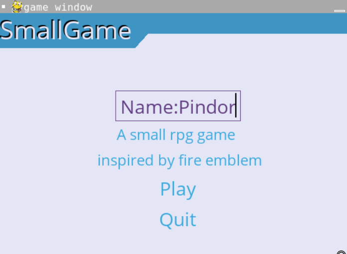
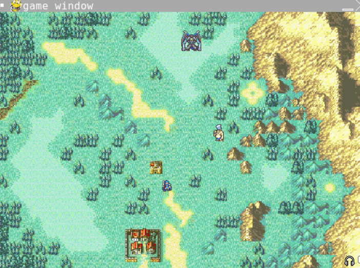
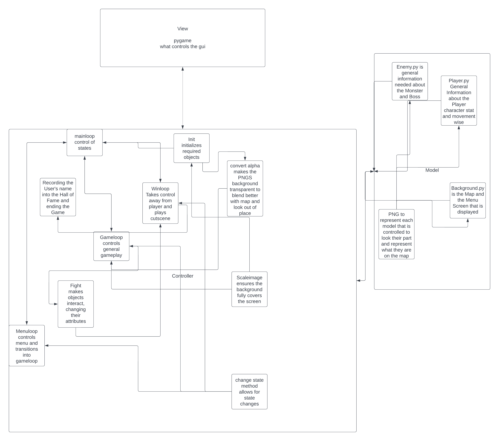

:warning: Everything between << >> needs to be replaced (remove << >> after replacing)
# CS110 Project Proposal
# A Ripoff of Fire Emblem But Seriously it is
## CS 110 Final Project
### Fall Semester, 2022
### [Assignment Description](https://docs.google.com/document/d/1H4R6yLL7som1lglyXWZ04RvTp_RvRFCCBn6sqv-82ps/edit?usp=sharing)

[repl](#)](https://replit.com/join/mdpcukgnro-jo-cheungcheung)

<< [link to demo presentation slides](#12) >>

### Team: 12
#### Jo Cheung Wong, Tim Zheng
***

## Project Description

<<Title Screen is where the user gets to deside the player's name and start the game. The game is really simple, using the arrow keys to move the player character to the monsters to attempt to fight it. Fighting will result in the monster losing HP till it dies and you move onto the demon lord to beat the game and you name will be recorded in a mini Hall of Fame.>>

***    

## User Interface Design

- **Initial Concept**
  - << Menu screen: user decides their name of the player that will be listed in Hall of Fame before starting game.
  * 
    Game screen: movement of player character around map to collide with monsters to fight them and kill them. >>
  * 
    
- **Final GUI**
  - <<  >>
  * 

  * 

***        

## Program Design
Our design is similar to Fire Emblem the Sacred Stones as we pulled sprites and a map from the game. We designed it to where the user would move the hero around the map to fight the monster and eventually the demon lord and when they win, their name would recorded into the Hall of Fame. 
* Non-Standard libraries
    * << You should have a list of any additional libraries or modules used (pygame, request) beyond non-standard python. 
         For each additional module you should include
         - url for the module documentation
         - a short description of the module >>
* Class Interface Design
    * << A simple drawing that shows the class relationships in your code (see below for an example). This does not need to be overly detailed, but should show how your code fits into the Model/View/Controller paradigm. >>
        * 
* Classes
    * <<Player: the Hero that the User controls, has movement with the arrow keys and has an objective to kill all monsters. Has an attack and speed stat to determine how far it moves when arrow keys are pressed and how much damage it can do to monsters when colliding with them
    * Enemy: the boss monster and regular Monster that threatens the Hero. Stationary and has HP stat and attack stat. Takes damage when colliding with Hero and pushs them back a random distance when countering. Boss monster is just a bigger and stronger version of the regular monster
    * Background: the Map and the Menu screen of the program and kind of measures where the character and Monsters are
    * Controller: the code that runs all the behind the scene actions like damage taken during collision, collision tracking, movement of each character and what pulls the needed information from each file to keep the game running. >>

## Project Structure and File List

The Project is broken down into the following file structure:

* main.py
* src
    * Background.py,Enemy.py,Player.py,Controller.py
    
* assets
    * << all of your media, i.e. images, font files, etc, should go here) >>
* etc
    * << This is a catch all folder for things that are not part of your project, but you want to keep with your project >>

***

## Tasks and Responsibilities 

  Tim Zheng - Subloop management and design
  Jo Cheung Wong - PNGS and Models
  Both - Everything else not credited to one person

## Testing

* << Describe your testing strategy for your project. >>

## ATP

| Step                 |Procedure             |Expected Results                   |
|----------------------|:--------------------:|----------------------------------:|
|  1                   | Start Program  |Menu Screen appears where name can be entered, the game can be played, and the game can be quit |
|  2                   | Choose Play   | changes to game screen where user assumes control of the Hero     |
|3|  Arrow up to move up, arrow left to move left, arrow down to move down, arrow right to move right | moves Hero in corrisponding direction of arrow key pressed
|4| All mosters are dead| Ending quote given by boss, name of user imputed in step 1 recording in Hall of Fame|
|5| user Name is recording in HOF| pygame exits and the program ends|
